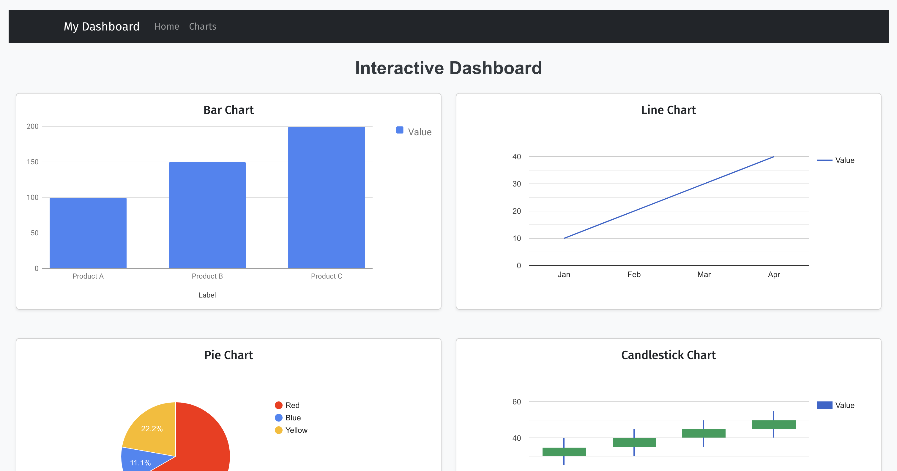

# Charts web application

This is a simple web application to display charts using Next.js on the frontend and Django API backend. The application features a basic dashboard page with multiple charts from the `react-google-charts` library,  and the data is retrieved from the backend.

The template for this project was generated using [turbo](https://github.com/unfoldadmin/turbo).



## Instructions

The instructions for this project are described in [this file](instructions.md).

## Running the application

No setup is required. Just run:

```bash
docker compose up
```

The frontend will be available at [http://localhost:3000](http://localhost:3000) and the backend at [http://localhost:8000](http://localhost:8000). The API is automatically documented at [http://localhost:8000/api/schema/swagger-ui/](http://localhost:8000/api/schema/swagger-ui/).

## Rational and design decisions

The Next.js frontend and Django backend were imposed for this project. Given that this combination is not common, there were not tons of templates to choose from. In terms of library for charts, I first tried `recharts` which I was more familiar with, but I had some issues getting a candlestick chart to work, so I switched to `react-google-charts` which was much easier to use. I used `bootstrap` and `react-bootstrap` for the layout and styling.

### Bonus points:

- [x] Using TypeScript in the Next.js app.
- [x] Implementing Docker for easy setup of both the Next.js frontend and Django backend.
- [ ] Adding basic unit tests or integration tests for the Django API or Next.js components.
- [ ] Using state management (like Redux) to handle the data in the frontend.
